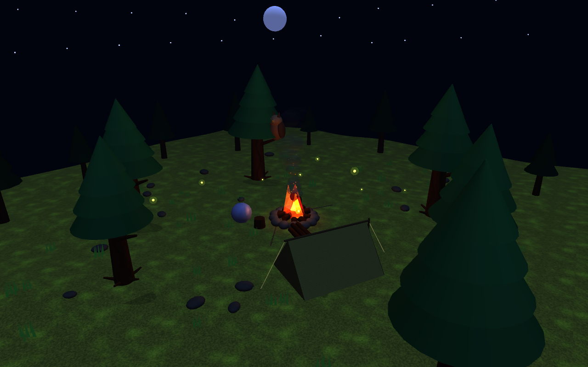
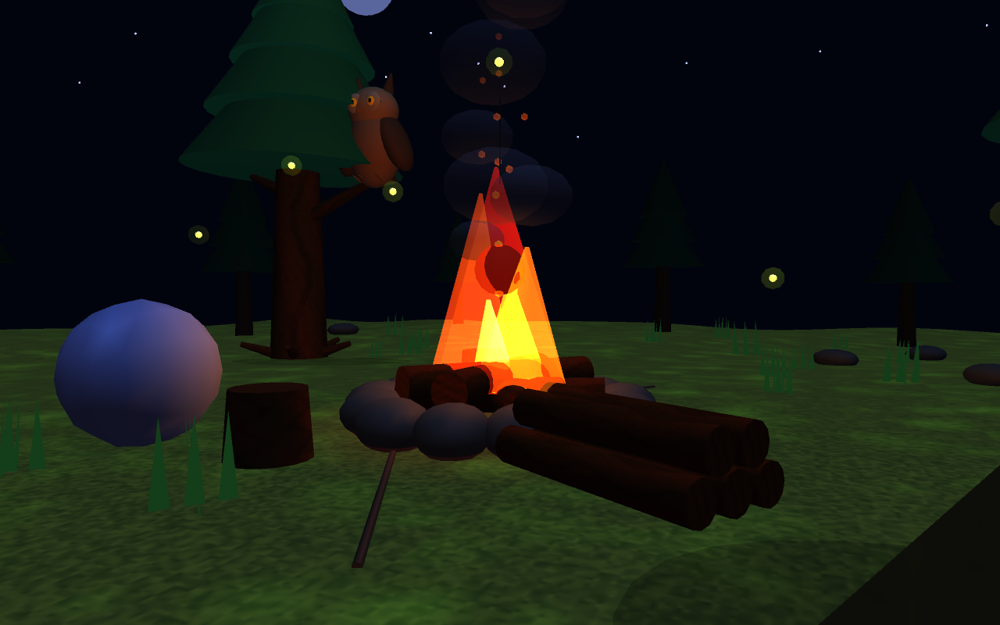
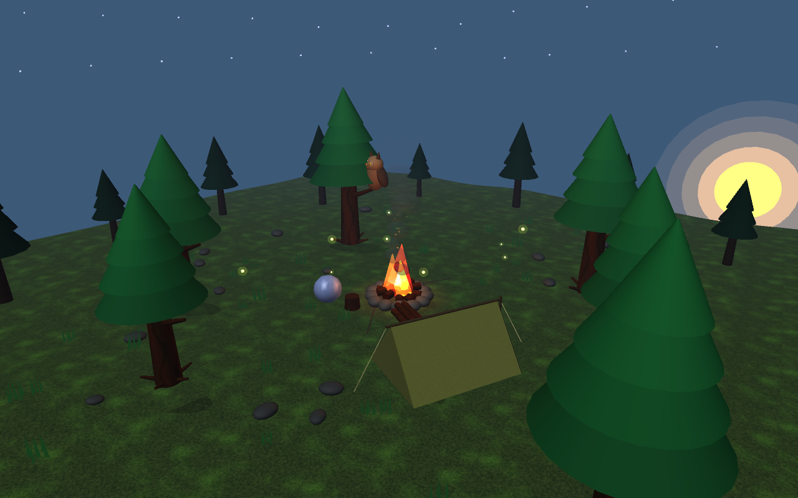

<div align="center">
  <h1>🌲 Moonlit Forest Campsite 🌙</h1>
  <p><strong>A real-time interactive 3D nighttime campsite scene built with C++ and OpenGL.</strong></p>
  
  
  
  [](https://isocpp.org/)
  [](https://www.opengl.org/)
  []()
</div>

## ✨ Features

- **Procedural Environment**: Gently uneven forest terrain, distant silhouette trees, and procedural grass.
- **Dynamic Animations**: Hierarchical owl with head tracking and wing flapping, drifting smoke particles, and flying fireflies.
- **Interactive Campfire**: Multi-layered flames, glowing coal bed, and throwable logs.
- **Atmospheric Lighting**: Smooth transitions from night to sunrise, dynamic campfire lighting, and depth fog.
- **Flexible Controls**: Orbit camera with zoom, elevation control, and interactive toggles.

## 📸 Screenshots

<p align="center">
  
  
</p>

## 🚀 Quick Start

### macOS
Compile directly with clang++ (requires Apple's OpenGL/GLUT frameworks):
```bash
clang++ -std=c++17 -Wno-deprecated-declarations -DGL_SILENCE_DEPRECATION main.cpp Particles.cpp Primitives.cpp Scene.cpp -framework OpenGL -framework GLUT -o campsite
./campsite
```

### Linux (Ubuntu/Debian)
Install dependencies and build using CMake:
```bash
sudo apt install freeglut3-dev cmake g++
mkdir build && cd build
cmake ..
make
./campsite
```

## 🎮 Controls

| Key/Action | Function | Key | Function |
| :--- | :--- | :--- | :--- |
| **Left-drag** / **Arrows** | Orbit camera & change elevation | **T** | Toggle sunrise / night |
| **Scroll** / `+` `-` | Zoom in / out | **W** | Toggle wind |
| **L** / **Click log pile** | Throw log into fire | **F** | Toggle atmospheric fog |
| **Space** | Pause/resume animations | **Q** / **Esc** | Quit |
